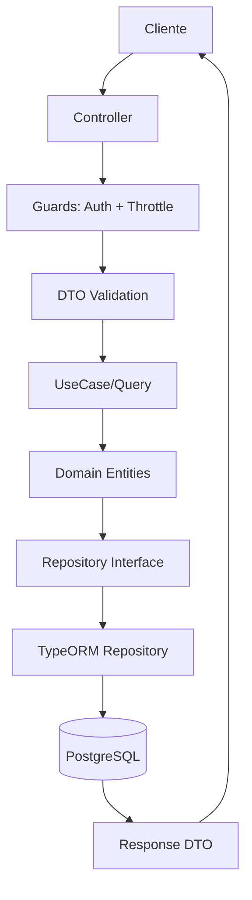

<div align="center">
  
  <h1>💰 Planejai - Backend</h1>
  <p><em>Backend da aplicação Planejai, um sistema de planejamento financeiro pessoal desenvolvido com NestJS.</em></p>
  <p>Permite gerenciamento completo de usuários, carteiras, categorias e lançamentos financeiros com segurança e escalabilidade.</p>

  <!-- Badges -->
  <p>
    
    
    
    
    
  </p>
  <p>
    
    
  </p>
</div>

---

## 📋 Sobre o Projeto

Planejai é uma plataforma de planejamento financeiro pessoal que ajuda usuários a gerenciar suas finanças de forma intuitiva e segura. O backend fornece APIs robustas para autenticação, gerenciamento de dados financeiros e integração com serviços externos.

### ✨ Funcionalidades Principais

- 🔐 **Autenticação Segura**: Login/logout com JWT e renovação automática.
- 👤 **Gerenciamento de Usuários**: Cadastro, perfil e recuperação de senha.
- 💳 **Carteiras e Lançamentos**: Controle de receitas/despesas com filtros avançados.
- 📊 **Relatórios**: Saldos mensais e gastos categorizados.
- 📧 **Notificações**: Envio de emails para verificação e alertas.

---

## 🛠️ Tecnologias Utilizadas

<div align="center">

| Categoria          | Tecnologia                                                          | Descrição                             |
| ------------------ | ------------------------------------------------------------------- | ------------------------------------- |
| **Framework**      | [NestJS](https://nestjs.com/)                                       | Framework Node.js escalável e modular |
| **Linguagem**      | [TypeScript](https://www.typescriptlang.org/)                       | Tipagem estática para código robusto  |
| **Banco de Dados** | [PostgreSQL](https://www.postgresql.org/)                           | RDBMS relacional com UUID e enums     |
| **ORM**            | [TypeORM](https://typeorm.io/)                                      | Mapeamento objeto-relacional          |
| **Autenticação**   | JWT + [Passport](https://www.passportjs.org/)                       | Tokens seguros via cookies HTTP-only  |
| **Rate Limiting**  | [@nestjs/throttler](https://docs.nestjs.com/security/rate-limiting) | Controle de taxa de requisições       |
| **Validação**      | [class-validator](https://github.com/typestack/class-validator)     | Validação automática de DTOs          |
| **Hashing**        | [bcrypt](https://www.npmjs.com/package/bcrypt)                      | Criptografia de senhas                |
| **Email**          | [Nodemailer](https://nodemailer.com/)                               | Envio via Gmail SMTP                  |
| **Testes**         | [Jest](https://jestjs.io/)                                          | Framework de testes unitários/e2e     |

</div>

---

## 🏗️ Arquitetura

O projeto adota **Domain-Driven Design (DDD)** e **CQRS** para uma arquitetura limpa e escalável.

### 📁 Estrutura de Diretórios

```
src/
├── 📂 modules/core/
│   ├── 📂 application/          # Camada de Aplicação (CQRS)
│   │   ├── 📂 usecases/         # Casos de Uso (Commands)
│   │   ├── 📂 queries/          # Consultas (Queries)
│   │   └── 📂 dtos/             # Data Transfer Objects
│   ├── 📂 controllers/          # Controladores HTTP
│   ├── 📂 domain/               # Domínio (Entidades, Regras)
│   │   ├── 📂 entities/         # Entidades de Domínio
│   │   ├── 📂 repositories/     # Interfaces de Repositório
│   │   └── 📂 services/         # Serviços de Domínio
│   └── 📂 infrastructure/       # Infraestrutura
│       ├── 📂 mappers/          # Mapeadores (Domain ↔ Infra)
│       ├── 📂 repositories/     # Implementações TypeORM
│       └── 📂 services/         # Serviços Externos (Email, Hash)
├── 📂 shared/
│   ├── 📂 infrastructure/       # Infra Compartilhada
│   │   ├── 📂 auth/             # JWT, Guards
│   │   └── 📂 database/         # Config DB
│   └── 📂 utils/                # Utilitários
├── 📂 migrations/               # Migrações TypeORM
├── 📂 config/                   # Configurações
├── 📂 common/                   # Filtros/Middlewares Globais
└── 📂 test/                     # Testes E2E
```

### 🏛️ Padrões Arquiteturais Implementados

O projeto adota uma combinação de **Clean Architecture**, **Domain-Driven Design (DDD)** e **padrões RESTful** para garantir modularidade, testabilidade e manutenibilidade.

#### 🧹 Clean Architecture

- **Separação de Camadas**:
  - **Entidades (Domain)**: Regras de negócio puras, independentes de frameworks.
  - **Casos de Uso (Application)**: Lógica de aplicação, orquestração de operações.
  - **Adaptadores (Infrastructure)**: Implementações concretas (DB, APIs externas).
  - **Frameworks/Drivers**: Camada externa (NestJS, TypeORM).
- **Princípio da Dependência**: Camadas internas não dependem de externas; inversão via interfaces.
- **Benefícios**: Facilita testes unitários, troca de tecnologias e isolamento de mudanças.

#### 🎯 Domain-Driven Design (DDD)

- **Entidades e Value Objects**: Modelos ricos com comportamento (ex.: `Usuario`, `Lancamento`).
- **Agregados**: Grupos consistentes (ex.: `Carteira` como raiz de agregado com lançamentos).
- **Repositórios**: Abstrações para persistência, implementadas via TypeORM.
- **Serviços de Domínio**: Lógica complexa não pertencente a entidades.
- **Bounded Contexts**: Separação clara entre módulos (auth, core).

#### 🔄 CQRS (Command Query Responsibility Segregation)

- **Commands**: Operações de escrita (ex.: `AdicionarLancamentoUseCase`) – alteram estado.
- **Queries**: Operações de leitura (ex.: `BuscarLancamentosQuery`) – não alteram estado.
- **Separação**: Modelos diferentes para otimização (ex.: queries com joins, commands validados).
- **Benefícios**: Performance em leituras, consistência em escritas, escalabilidade.

#### 🌐 Padrões RESTful

- **Recursos e URIs**: Endpoints representam recursos (ex.: `/usuario`, `/carteira/:id/lancamentos`).
- **Verbos HTTP**:
  - `GET` para leitura.
  - `POST` para criação.
  - `PUT` para atualização completa.
  - `DELETE` para remoção.
- **Códigos de Status**: Padrão HTTP (200 OK, 401 Unauthorized, 429 Too Many Requests).
- **HATEOAS**: Links contextuais em respostas (futuro: incluir `_links`).
- **Versionamento**: Via URL (ex.: `/v1/auth/login` – preparado para evolução).
- **Benefícios**: API previsível, cacheável e escalável.

### 🔄 Fluxo de Dados



### 🏛️ Padrões Arquiteturais

Ver seção [Padrões Arquiteturais Implementados](#-padrões-arquiteturais-implementados) para detalhes técnicos.

- **Clean Architecture**: Separação em camadas independentes.
- **DDD**: Modelagem focada no domínio.
- **RESTful**: API seguindo princípios REST.
- **CQRS**: Separação de leitura/escrita.
- **Dependency Injection**: Via NestJS.
- **SOLID**: Princípios orientados a objetos.

---

## 🚀 Instalação e Configuração

### 📋 Pré-requisitos

- 🟢 Node.js 18+
- 🐘 PostgreSQL 13+
- 📦 npm ou yarn

### ⚙️ Passos de Instalação

1. **Clone o repositório**:

   ```bash
   git clone <repo-url>
   cd planejai/back-end
   ```

2. **Instale dependências**:

   ```bash
   npm install
   ```

3. **Configure variáveis de ambiente**:
   Copie `.env.example` para `.env`:

   ```env
   PORT=3000
   CORS_ORIGIN=http://localhost:5173
   FRONTEND_URL=http://localhost:5173
   JWT_SECRET=<chave-secreta-forte>
   DB_HOST=localhost
   DB_PORT=5432
   DB_NAME=planejai
   DB_USER=postgres
   DB_PASSWORD=<senha-db>
   DATABASE_URL=postgresql://postgres:<senha>@localhost:5432/planejai?schema=public
   GMAIL_USER=<email@gmail.com>
   GMAIL_PASS=<app-password>
   ```

4. **Configure o banco**:

   - Crie o banco PostgreSQL.
   - Execute migrações:
     ```bash
     npm run migration:run
     ```

5. **Execute a aplicação**:

   ```bash
   # Desenvolvimento
   npm run start:dev

   # Produção
   npm run build
   npm run start:prod
   ```

---

## 📖 Uso

### 🌐 Endpoints Principais (API REST)

<div align="center">

| Método   | Endpoint                       | Descrição            | Autenticação |
| -------- | ------------------------------ | -------------------- | ------------ |
| `POST`   | `/auth/login`                  | Login do usuário     | ❌           |
| `POST`   | `/auth/logout`                 | Logout               | ✅           |
| `GET`    | `/auth/validate`               | Validar token        | ✅           |
| `POST`   | `/usuario`                     | Criar usuário        | ❌           |
| `GET`    | `/usuario`                     | Buscar perfil        | ✅           |
| `PUT`    | `/usuario`                     | Atualizar perfil     | ✅           |
| `DELETE` | `/usuario`                     | Deletar conta        | ✅           |
| `GET`    | `/carteira/:id/saldo`          | Saldo mensal         | ✅           |
| `GET`    | `/carteira/:id/lancamentos`    | Listar lançamentos   | ✅           |
| `POST`   | `/carteira/:id/lancamento`     | Adicionar lançamento | ✅           |
| `PUT`    | `/carteira/:id/lancamento/:id` | Atualizar lançamento | ✅           |
| `DELETE` | `/carteira/:id/lancamento/:id` | Deletar lançamento   | ✅           |
| `GET`    | `/categoria`                   | Listar categorias    | ✅           |
| `GET`    | `/categoria/:id`               | Buscar categoria     | ✅           |

</div>

> 💡 Todos os endpoints protegidos requerem cookie `access_token` válido.

### 🧪 Testes

```bash
# Unitários
npm run test

# E2E
npm run test:e2e

# Cobertura
npm run test:cov
```

---

## 🗄️ Banco de Dados

### 📊 Schema Principal

```sql
-- Usuários
usuarios (id UUID, nome VARCHAR, email VARCHAR UNIQUE, senha VARCHAR, telefone VARCHAR, avatar VARCHAR, criado_em TIMESTAMP)

-- Carteiras
carteiras (id UUID, usuario_id UUID FK, criado_em TIMESTAMP)

-- Categorias
categorias (id SERIAL, nome VARCHAR UNIQUE, tipo ENUM('entrada','saida','ambos'))

-- Lançamentos
lancamentos (id SERIAL, carteira_id UUID FK, categoria_id INT FK, titulo VARCHAR, descricao VARCHAR, valor DECIMAL, data DATE, tipo ENUM, criado_em TIMESTAMP)

-- Saldos Mensais
saldos_mensais (id SERIAL, carteira_id UUID FK, mes INT, ano INT, saldo_mes DECIMAL, criado_em TIMESTAMP)
```

### 🔄 Migrações

Gerenciadas por TypeORM.

```bash
# Gerar nova migração
npm run typeorm -- migration:generate src/migrations/NomeMigracao -d src/config/database.config.ts

# Executar migrações
npm run migration:run
```

---

## 🔒 Segurança

- ✅ **Autenticação JWT**: Via cookies HTTP-only com renovação automática.
- ✅ **Rate Limiting**: 3 requisições/min por IP.
- ✅ **Validação**: DTOs sanitizados com class-validator.
- ✅ **HTTPS Recomendado**: Cookies seguros em produção.
- ⚠️ **Credenciais Seguras**: Nunca commite `.env`; use variáveis de ambiente.

---

## 🛠️ Desenvolvimento

### 📜 Scripts Disponíveis

<div align="center">

| Comando                      | Descrição                           |
| ---------------------------- | ----------------------------------- |
| `npm run start:dev`          | Modo desenvolvimento com hot-reload |
| `npm run build`              | Compilação para produção            |
| `npm run start:prod`         | Executar em produção                |
| `npm run test`               | Testes unitários                    |
| `npm run test:e2e`           | Testes E2E                          |
| `npm run lint`               | Verificação de código               |
| `npm run migration:generate` | Gerar migração                      |
| `npm run migration:run`      | Executar migrações                  |

</div>

### 🤝 Contribuição

1. Fork o projeto.
2. Crie uma branch (`git checkout -b feature/nova-feature`).
3. Commit suas mudanças (`git commit -m 'Adiciona nova feature'`).
4. Push para a branch (`git push origin feature/nova-feature`).
5. Abra um Pull Request.

### 📄 Licença

Este projeto é privado. Contate o proprietário para permissões.

---

<div align="center">
  <p>Feito com ❤️ usando NestJS</p>
  <p>
    <a href="#planejai---backend">Voltar ao topo</a>
  </p>
</div>

- Author - [Willian Rodrigues](https://www.linkedin.com/in/willianrdrigues/)
